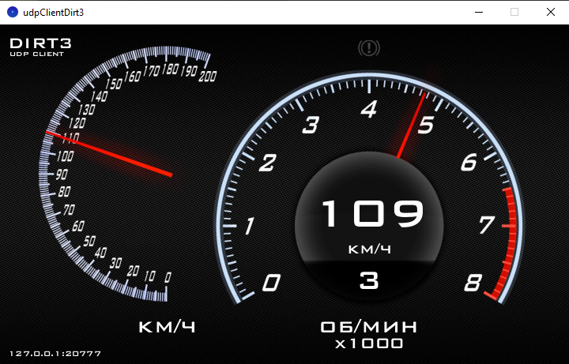

# udpClientDirt3
Эта небольшая программа предназначена для отображения данных, отправляемых игрой DIRT3 по протоколу UDP.

## Описание
Программа принимает UDP-пакеты и отображает скорость, обороты двигателя, номер передачи и активацию ручного тормоза в виде импровизированной приборной панели.

Названия данных в UDP-пакете были взяты из проекта [Dirt3TelemetryDisplay](https://github.com/Sztorm/Dirt3TelemetryDisplay/tree/master).

