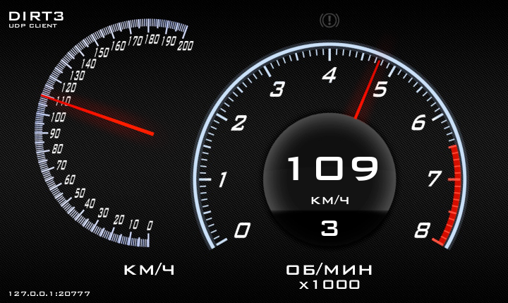

# udpClientDirt3


## Описание
Эта небольшая программа предназначена для отображения данных, отправляемых игрой DIRT3 по протоколу UDP.
Программа принимает UDP-пакеты и отображает скорость, обороты двигателя, номер передачи и активацию ручного тормоза в виде импровизированной приборной панели.

Названия данных в UDP-пакете были взяты из проекта [Dirt3TelemetryDisplay](https://github.com/Sztorm/Dirt3TelemetryDisplay/tree/master).

UDP-пакет (152 байта) разобран в файле ``udpClientDirt3.pde`` в функции ``receive()``.

## Структура UDP-пакета
| №  | Байты      | Название переменной в программе  | Описание переменной |
| -- | ---------- | -------------------------------- | ------------------- |
| 1  | 0 - 4      | time                             | Время, с                                        |
| 2  | 4 - 8      | currentLapTime                   | Время круга, с                                  |
| 3  | 8 - 12     | distanceCurrentLap               | Пройденное расстояние, м                        |
| 4  | 12 - 16    | distance                         | Нормализованное расстояние, ?                   |
| 5  | 16 - 20    | worldPositionX                   | Глобальная координата X, м                      |
| 6  | 20 - 24    | worldPositionY                   | Глобальная координата Y, м                      |
| 7  | 24 - 28    | worldPositionZ                   | Глобальная координата Z, м                      |
| 8  | 28 - 32    | speed                            | Скорость, м/с                                   |
| 9  | 32 - 36    | velocityX                        | Скорость по оси X, м/с                          |
| 10 | 36 - 40    | velocityY                        | Скорость по оси Y, м/с                          |
| 11 | 40 - 44    | velocityZ                        | Скорость по оси Z, м/с                          |
| 12 | 44 - 48    | objectToWorldLeftDirection_X     | ?                                               |
| 13 | 48 - 52    | objectToWorldLeftDirection_Y     | ?                                               |
| 14 | 52 - 56    | objectToWorldLeftDirection_Z     | ?                                               |
| 15 | 56 - 60    | objectToWorldForwardDirection_X  | ?                                               |
| 16 | 60 - 64    | objectToWorldForwardDirection_Y  | ?                                               |
| 17 | 64 - 68    | objectToWorldForwardDirection_Z  | ?                                               |
| 18 | 68 - 72    | rearLeftSuspensionPosition_mm    | Положение левой задней подвески, мм             |
| 19 | 72 - 76    | rearRightSuspensionPosition_mm   | Положение правой задней подвески, мм            |
| 20 | 76 - 80    | frontLeftSuspensionPosition_mm   | Положение левой передней подвески, мм           |
| 21 | 80 - 84    | frontRightSuspensionPosition_mm  | Положение правой передней подвески, мм          |
| 22 | 84 - 88    | rearLeftSuspensionSpeed_mm_s     | Скорость левой задней подвески, мм/с            |
| 23 | 88 - 92    | rearRightSuspensionSpeed_mm_s    | Скорость правой задней подвески, мм/с           |
| 24 | 92 - 96    | frontLeftSuspensionSpeed_mm_s    | Скорость левой передней подвески, мм/с          |
| 25 | 96 - 100   | frontRightSuspensionSpeed_mm_s   | Скорость правой передней подвески, мм/с         |
| 26 | 100 - 104  | rearLeftWheelSpeed_m_s           | Скорость заднего левого колеса, м/с             |
| 27 | 104 - 108  | rearRightWheelSpeed_m_s          | Скорость заднего правого колеса, м/с            |
| 28 | 108 - 112  | frontLeftWheelSpeed_m_s          | Скорость переднего левого колеса, м/с           |
| 29 | 112 - 116  | frontRightWheelSpeed_m_s         | Скорость переднего правого колеса, м/с          |
| 30 | 116 - 120  | accelerationInput                | Активация педали газа [0, 1]                    |
| 31 | 120 - 124  | steeringInput                    | Поворот руля: налево, прямо, направо [-1, 0, 1] |
| 32 | 124 - 128  | brakeInput                       | Активация педали тормоза [0, 1]                 |
| 33 | 128 - 132  | handbrakeInput                   | Активация ручного тормоза [0, 1]                |
| 34 | 132 - 136  | gear                             | Номер передачи [1, 2, 3, ...10 - задняя]        |
| 35 | 136 - 140  | gForceLateral                    | Поперечная перегрузка, g                        |
| 36 | 140 - 144  | gForceLongitudinal               | Продольная перегрузка, g                        |
| 37 | 144 - 148  | currentLap                       | Номер круга                                     |
| 38 | 148 - 152  | rpm                              | Обороты двигателя, об/мин                       |

## Настройка перед запуском
Необходимо внести изменения в файл ``hardware_settings_config.xml`` для того, чтобы игра начала отдавать данные телеметрии.
* Нажмите клавиши ``Win+R``
* В открывшемся окне введите ``%USERPROFILE%\Documents\My Games\DiRT3\hardwaresettings``
* Откройте файл ``hardware_settings_config.xml``
* Найдите строку ``<motion ...`` и замените ее на
```<motion enabled="true" ip="127.0.0.1" port="20777" delay="1" extradata="3" />```
* Сохраните и закройте файл

Также **рекомендую** скачать и запустить программу [DiRTTelemetryErrorFix](https://github.com/RoccoC/DiRTTelemetryErrorFix) перед запуском игры DIRT3, чтобы устранить ошибку, которая приводит к сбою после завершения каждой гонки с включенным выводом телеметрии.

## Сборка и запуск
* Установите [Processing](https://processing.org/download) и запустите скетч ``udpClientDirt3.pde``.

**или**

* Скачайте архив [udpClientDirt3_build.zip](https://github.com/kimoncar/udpClientDirt3/raw/refs/heads/main/udpClientDirt3_build.zip), разархивируйте и запустите ``udpClientDirt3.exe``.

Для запуска программы необходим [Java Runtime Environment 17](https://adoptium.net), если он у вас не установлен, программа предложит его установить и откроет страницу в браузере для скачивания.